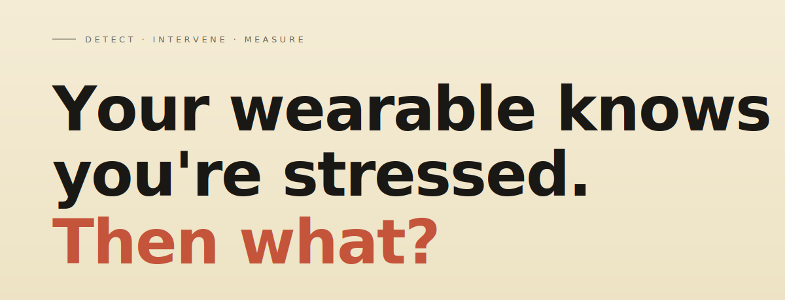

<div align="center">

<picture>
  <source media="(prefers-color-scheme: dark)" srcset="./assets/banner-dark.svg">
  <source media="(prefers-color-scheme: light)" srcset="./assets/banner-light.svg">
  
</picture>

&nbsp;

[](https://github.com/DaoBrewAI/daobrew-wellness-mcp)
&nbsp;
[](https://daobrew.app)

</div>

&nbsp;

## 🌿 &nbsp;What this is

Most "wellness" stops at *interpretation* — here is your HRV, here is your stress score, good luck. **We close the loop.**

DaoBrew reads your wearable, classifies your current stress pattern, and runs a 3-minute music-guided breathing session that brings your nervous system back online.

**Detect → Intervene → Measure.** No mantras, no narrators, no tutorials.

> Wearables tell you *how you are*. We tell your body *how to come back*.

&nbsp;

## 🫁 &nbsp;The core — music-guided resonance breathing

> The active ingredient in stress relief is breathing at 4–7 breaths per minute, sustained for five minutes. Everything else exists to make that happen — without you having to think about it.

Music-guided resonance breathing is the entire product. The music's volume swells pace your inhale and exhale at your personal resonance frequency. With headphones, a theta binaural layer fades in. Apple Watch streams your heart rate and the session re-tunes itself mid-stream. By the time the music fades out, your HRV has measurably shifted.

**Why this approach, not the alternatives:**

- Generic meditation apps are content libraries. We are an intervention engine. Calm and Headspace can't tell you what to do *right now, given your current state* — we can.
- Wearables (WHOOP, Oura, Apple Watch) are sensors. We are the action layer they were missing. We complement them; we don't compete.
- LLM-based "AI health coaches" got walked back across the industry in 2025–26 for liability reasons. Specialized, deterministic intervention is the platform-native answer.

The session is 3 minutes because that is the gap between async agent runs, between meetings, between the email you just got and the one you're about to send. Recovery infrastructure has to fit the 2026 high performer — not the other way around.

&nbsp;

## 🔓 &nbsp;Open source

We ship the engine three ways: a consumer iOS app, a B2B SDK for hardware partners, and **everything that benefits the developer community, in the open.**

<table>
  <thead>
    <tr>
      <th align="left">Repository</th>
      <th align="left">What it is</th>
      <th align="left">Stack</th>
    </tr>
  </thead>
  <tbody>
    <tr>
      <td>
        <a href="https://github.com/DaoBrewAI/daobrew-wellness-mcp"><b><code>daobrew-wellness-mcp</code></b></a>
      </td>
      <td>The first wellness MCP server in production. Lets any agent — Claude Code, Cursor, Windsurf, Cline — detect stress and trigger a recovery session without leaving the editor.</td>
      <td><sub><code>TypeScript · MCP</code></sub></td>
    </tr>
    <tr>
      <td>
        <a href="https://github.com/DaoBrewAI/building-in-public"><b><code>building-in-public</code></b></a>
      </td>
      <td>Claude Skills we built for ourselves and shipped publicly: <code>bazi-reader</code>, <code>design-language-translator</code>, with more landing as they prove out.</td>
      <td><sub><code>Claude Skills</code></sub></td>
    </tr>
  </tbody>
</table>

### `@daobrew/wellness-mcp` &nbsp;— &nbsp;the agent-native action layer

```bash
npm install -g @daobrew/wellness-mcp
```

When Claude Code sees you've been debugging for 90 minutes and your HRV just dropped, the right answer is for the agent to call a wellness tool — not to suggest you "take a break." MCP governance moved to the Linux Foundation in late 2025; this is the architecture going forward. We were the first wellness company to ship there.

### Claude Skills &nbsp;— &nbsp;tooling that didn't exist, packaged and given back

Building DaoBrew required AI tooling that didn't exist. Rather than keep it internal, we package them as installable [Claude Skills](https://docs.claude.com/en/docs/build-with-claude/agent-skills):

- **[`bazi-reader`](https://github.com/DaoBrewAI/building-in-public/blob/main/bazi-reader.skill)** — accurate Four Pillars chart generation, including monthly forecast. Handles edge cases (solar terms, zi-hour rollover) that LLMs alone get wrong.
- **[`design-language-translator`](https://github.com/DaoBrewAI/building-in-public/blob/main/design-language-translator.skill)** — converts founder-grade visual intent ("make it more 禅", "this feels off") into a precise designer brief, bilingual EN↔CN.
- **More planned** — pulse waveform feature extraction, TCM stress pattern classification reference implementations.

### Where we draw the line

What helps the AI-native developer ecosystem stay healthy belongs in the commons. The prescription engine, the personal baseline calibration, and the proprietary pulse models trained on 200K+ annotated sessions stay closed. The line is intentional and clear.

&nbsp;

<div align="center">
  <sub><i>If your nervous system runs hot, you are the user.</i></sub>
</div>
